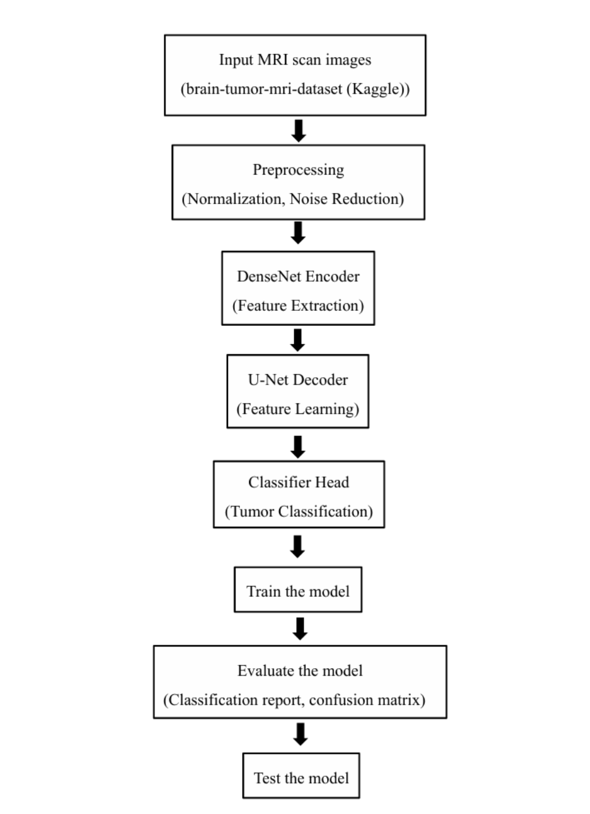

# Brain Tumor Classification Using DenseNet121 and U-Net

## Overview
This project presents a hybrid deep learning framework for brain tumor classification from MRI images. The model combines DenseNet121 for feature extraction and a U-Net inspired architecture for enhanced spatial learning and multi-class classification.

## Dataset
- Brain Tumor MRI Dataset (Kaggle)
- Classes:
  - Glioma
  - Meningioma
  - Pituitary Tumor
  - No Tumor

## Technologies Used
- Python
- TensorFlow
- Keras
- NumPy
- OpenCV
- Matplotlib

## Methodology
1. MRI image preprocessing
2. Image normalization and resizing
3. DenseNet121 feature extraction
4. U-Net inspired feature refinement
5. Multi-class tumor classification

## Project Structure
```
project/
├── dataset/
├── models/
├── notebooks/
├── training/
├── testing/
└── README.md
```

## Applications
- Computer-aided diagnosis
- Medical image analysis
- Brain tumor screening

## Authors
- Md Abdul Ahad
- K. Sathvika

## Proposed Framework



The proposed framework uses MRI images as input, applies preprocessing techniques, extracts deep features using DenseNet121, refines spatial information through a U-Net inspired decoder, and performs multi-class brain tumor classification.
